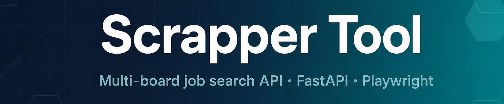
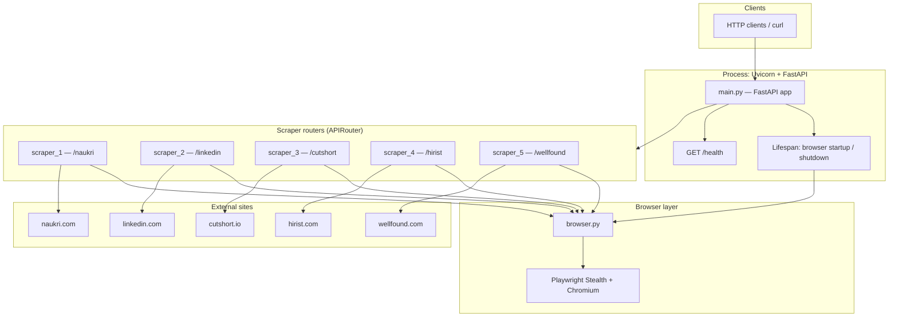
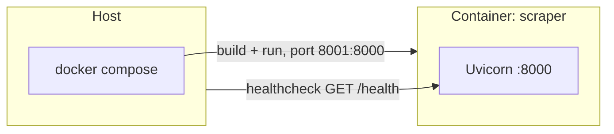

<p align="center">
  
</p>

**Multi-board job search API** — a small [FastAPI](https://fastapi.tiangolo.com/) service that exposes HTTP endpoints to fetch job listings from several job boards. One shared headless Chromium instance ([Playwright](https://playwright.dev/python/) + stealth) starts with the app and is reused by all scrapers.

[](https://www.python.org/)
[](https://fastapi.tiangolo.com/)
[](https://playwright.dev/python/)
[](docker-compose.yml)

| | |
|---|---|
| **Stack** | FastAPI · Uvicorn · Playwright (stealth) · optional Docker Compose |
| **Endpoints** | `/naukri` · `/linkedin` · `/cutshort` · `/hirist` · `/wellfound` · `GET /health` |

## Supported job boards

Scrapers are implemented for these job sites (each maps to an API route prefix):

| Job board | Route prefix |
| --- | --- |
| [Naukri](https://www.naukri.com/) | `/naukri` |
| [LinkedIn](https://www.linkedin.com/) | `/linkedin` |
| [Hirist](https://www.hirist.tech/) | `/hirist` |
| [Cutshort](https://cutshort.io/) | `/cutshort` |
| [Wellfound](https://wellfound.com/) | `/wellfound` |

---

## Disclaimer

This project is for **education and personal automation**. Third-party job sites have their own **terms of use**, rate limits, and technical protections. You are responsible for using this software **lawfully** and in line with each site's rules. The authors are not liable for misuse.

---

## Contents

- [Supported job boards](#supported-job-boards)
- [Architecture](#architecture)
- [Deployment (optional)](#deployment-optional)
- [Local run](#local-run)
- [Top contributors](#top-contributors)

---

## Architecture



**Request path:** an HTTP call hits `main.py`, which routes to the matching `APIRouter`. The router uses `get_browser()` to drive headless Chromium and returns parsed job data. `GET /health` reports whether the shared browser was initialized.

---

## Deployment (optional)



`docker-compose.yml` maps host port **8001** to the app on **8000** inside the container and runs a healthcheck against `/health`. Playwright benefits from extra shared memory (`shm_size`).

---

## Local run

**1. Install dependencies**

```bash
pip install -r requirements.txt
playwright install chromium
```

**2. Run the server**

```bash
# default port 8000
uvicorn main:app --reload

# custom port
PORT=9000 python main.py
```

**3. Hit an endpoint**

```bash
curl "http://localhost:8000/linkedin?query=python+developer&location=bangalore"
curl "http://localhost:8000/health"
```

---

## Environment variables

| Variable | Default | Description |
|---|---|---|
| `PORT` | `8000` | Port Uvicorn listens on |

---

## Project structure

```
job-scraper/
├── main.py               # FastAPI app + lifespan
├── browser.py            # Shared Playwright browser instance
├── scrapers/
│   ├── scraper_1.py
│   ├── scraper_2.py
│   ├── scraper_3.py
│   ├── scraper_4.py
│   └── scraper_5.py
├── requirements.txt
└── docker-compose.yml
```

---

## Top contributors

Thanks to everyone who helps improve this project.

**Live data:** avatars and counts below are fetched from GitHub when you open this page ([contrib.rocks](https://contrib.rocks) + [Shields.io](https://shields.io/)). They update as new people contribute.

<p align="center">
  <a href="https://github.com/akxhat06/naukari-scrapper/graphs/contributors">
    
  </a>
</p>

<p align="center">
  <a href="https://github.com/akxhat06/naukari-scrapper/graphs/contributors" title="View all contributors on GitHub">
    
  </a>
</p>

> **Be part of this project** — if you do not see contributors above yet (new repo, private fork, or image blocked), you can still help: **[open a pull request](https://github.com/akxhat06/naukari-scrapper/compare)** or **[start an issue](https://github.com/akxhat06/naukari-scrapper/issues)** with ideas, bugs, or docs. First-time contributors are welcome.

[](https://github.com/akxhat06/naukari-scrapper/compare)